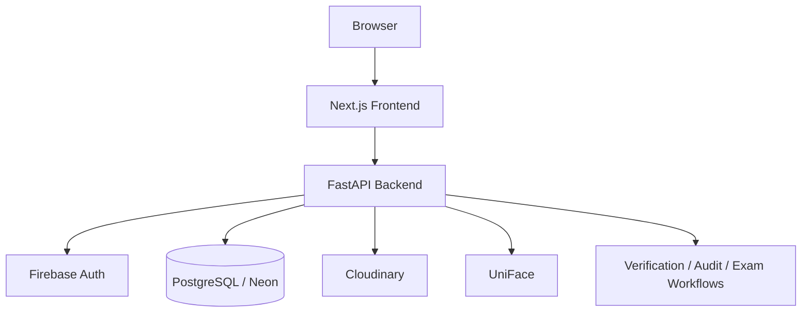

# ExamGuard

> AI-powered examination management and face-verification platform
> designed for secure, role-based examination workflows.

[Live Demo](https://exam-guardian-management.vercel.app) · [Architecture](docs/architecture.md) · [App Flow](docs/APP_FLOW.md) · [Roadmap](docs/roadmap.md)

ExamGuard supports examination operations end to end: student and exam data,
hall-ticket workflows, invigilator assignments, reference-face enrollment,
webcam-based identity verification, attendance, and audit-oriented security
signals.

## Key capabilities

- Firebase authentication with ExamGuard JWT sessions and role-based access control (Admin / Operator / Invigilator / Reviewer)
- Examination, registration, seating, and hall-ticket management
- Reference-face enrollment with Cloudinary-backed storage
- Webcam capture and server-side face verification via UniFace
- Invigilator verification workflow with evidence review and decision audit trail
- Attendance, monitoring, and anti-proxy security signals
- PostgreSQL persistence (Neon in the current deployment)

## Demo

| Service | URL |
|---|---|
| Frontend (Vercel) | https://exam-guardian-management.vercel.app |
| Backend API (Railway) | https://examguard-production-ef78.up.railway.app |
| API docs (local) | http://localhost:8000/docs |

> Demo data uses fixed demo students/exams. Do not treat the public demo as a production exam system.

## Architecture



```text
Browser
  -> Next.js frontend (Vercel)
  -> FastAPI backend (Railway)
       -> Firebase authentication (token exchange)
       -> PostgreSQL / Neon
       -> Cloudinary (reference face images)
       -> UniFace (detection, embedding, anti-spoof)
       -> Exam / verification / attendance / audit services
```

Detailed structure: [docs/architecture.md](docs/architecture.md)

## Technology stack

| Layer | Technologies |
|---|---|
| Frontend | Next.js 16, React 19, TypeScript, Tailwind CSS 4 |
| Backend | Python 3.11+, FastAPI, SQLAlchemy, Alembic |
| Database | PostgreSQL (Neon) |
| Auth | Firebase Authentication + HS256 JWT (PyJWT) |
| Face verification | UniFace (RetinaFace / ArcFace / MiniFASNet), provider abstraction |
| Media storage | Cloudinary |
| Deploy | Vercel (frontend), Railway (backend) |

## Authentication and RBAC

1. User signs in with Firebase (Google).
2. Frontend exchanges the Firebase ID token at `POST /api/v1/auth/firebase/exchange`.
3. Backend verifies the token, maps/creates the user, and issues an ExamGuard JWT.
4. Subsequent API calls use `Authorization: Bearer <jwt>`.
5. Role guards (`require_role`) restrict routes to Admin / Operator / Invigilator / Reviewer as configured.

Never commit service-account JSON, Cloudinary secrets, database URLs with credentials, or JWT signing keys.

## Face verification architecture

1. **Enrollment** — admin/demo flow uploads a reference face; backend validates the image and persists an absolute `https://` URL (Cloudinary).
2. **Capture** — invigilator/admin UI starts the browser camera and captures a probe frame (JPEG).
3. **Verify** — `POST /api/v1/identity-verifications/{attempt_id}/verify-face` downloads the stored reference (with a short TTL cache), runs UniFace, and records evidence.
4. **Decision** — `POST .../evaluate` applies threshold policy (match threshold `0.85` by default) and completes the attempt with an auditable decision.

Recoverable probe issues (for example, no face / multiple faces in the live frame) return a clear client error and do **not** permanently fail the attempt.

See [docs/APP_FLOW.md](docs/APP_FLOW.md) and `backend/app/services/face_verification/`.

## Demo workflow

1. Sign in on the live demo.
2. Load demo scenario data (demo students/exams/attempts).
3. Enroll or re-upload a reference face for a demo candidate.
4. Open **Invigilator → Verify Face**.
5. Allow camera access; verification runs against the stored reference.
6. Review evidence and decision on the attempt.

## Local development

### Prerequisites

- Python 3.11+
- Node.js 18+
- PostgreSQL 15+

### Backend

```bash
cd backend
python -m venv .venv
# Windows: .venv\Scripts\activate
source .venv/bin/activate   # Unix
pip install -e ".[dev]"
# optional real face provider
pip install -e ".[uniface]"

alembic upgrade head
uvicorn app.main:app --reload --port 8000
```

### Frontend

```bash
cd frontend
npm install
npm run dev
```

Frontend: http://localhost:3000

### Environment variables

Copy `.env.example` → `.env` (and `frontend/.env.example` → `frontend/.env.local`).  
Variable **names** only in examples — never commit real values.

| Variable | Purpose |
|---|---|
| `DATABASE_URL` | PostgreSQL connection string |
| `SECRET_KEY` | JWT signing secret (unique per environment) |
| `CORS_ORIGINS` | Allowed origins (JSON array) |
| `NEXT_PUBLIC_API_URL` | Backend base URL for the frontend |
| `FIREBASE_PROJECT_ID` | Firebase project id |
| `FIREBASE_WEB_API_KEY` | Firebase web API key (Identity Toolkit exchange) |
| `FACE_VERIFICATION_PROVIDER` | `uniface` or `deterministic` |
| `CLOUDINARY_CLOUD_NAME` | Cloudinary cloud name |
| `CLOUDINARY_API_KEY` | Cloudinary API key |
| `CLOUDINARY_API_SECRET` | Cloudinary API secret |

## Testing

```bash
cd backend
pytest -q
```

Last verified full backend suite: **2518 passed**.

Frontend unit/E2E tooling: Playwright configs live under `frontend/tests/` (run when browsers are installed).

## Deployment

| Service | Platform | Notes |
|---|---|---|
| Frontend | Vercel project `exam-guard` | Deploy from repo with `frontend` as root |
| Backend | Railway service `ExamGuard` | Dockerfile / Nixpacks; `pip install ".[uniface]"` |
| Database | Neon PostgreSQL | Migrations via Alembic |

See [docs/DEPLOYMENT.md](docs/DEPLOYMENT.md).

## Project structure

```text
ExamGuard/
├── backend/          # FastAPI, SQLAlchemy, Alembic, tests
├── frontend/         # Next.js App Router UI
├── docs/             # Product, architecture, flow, roadmap docs
├── .env.example      # Root env template (names only)
├── vercel.json
└── README.md
```

## Security considerations

- Firebase service accounts and Cloudinary secrets stay server-side / env-only
- JWT auth with short expiry; role-based route guards
- Image validation (size, format, corruption) before face processing
- Rate limits and typed failure categories on verification endpoints
- Audit-oriented evidence storage for review workflows

See [SECURITY.md](SECURITY.md).

## Known limitations

- Human-in-the-browser camera UX and cross-person negative face tests still need manual acceptance on the live demo
- No CI workflow is configured in this repository yet
- Public demo is not a hardened multi-tenant production exam service
- OCR / hall-ticket extraction quality depends on document scan quality

## Roadmap

See [docs/roadmap.md](docs/roadmap.md) and [docs/progress.md](docs/progress.md).

## Documentation

| Doc | Contents |
|---|---|
| [docs/APP_FLOW.md](docs/APP_FLOW.md) | Role workflows and UI flows |
| [docs/architecture.md](docs/architecture.md) | Structure and principles |
| [docs/TRD.md](docs/TRD.md) | Technical requirements |
| [docs/PRD.md](docs/PRD.md) | Product requirements |
| [docs/BACKEND_SCHEMA.md](docs/BACKEND_SCHEMA.md) | Data model overview |
| [docs/DEPLOYMENT.md](docs/DEPLOYMENT.md) | Deploy notes |
| [docs/TESTING.md](docs/TESTING.md) | Test commands and scope |
| [docs/FACE_VERIFICATION.md](docs/FACE_VERIFICATION.md) | Face pipeline overview |
| [SECURITY.md](SECURITY.md) | Security policy |
| [CONTRIBUTING.md](CONTRIBUTING.md) | Contribution guidelines |

## License

No license file has been selected yet. Licensing should be chosen intentionally by the repository owner before external contribution or reuse.
