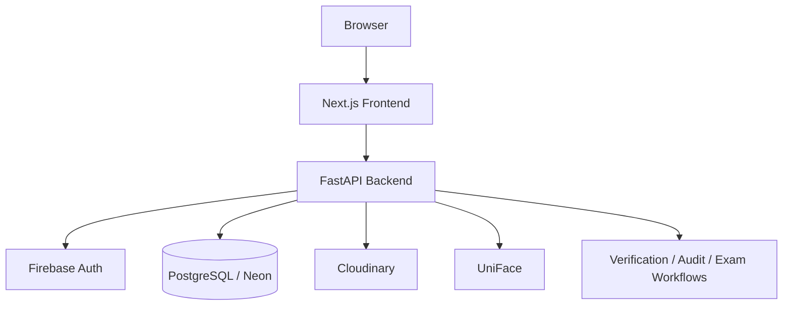

# ExamGuard

[](https://github.com/skandachandrashekar335-wq/ExamGuard/actions/workflows/backend.yml)
[](https://github.com/skandachandrashekar335-wq/ExamGuard/actions/workflows/frontend.yml)

> AI-powered examination management and identity-verification platform for
> secure, role-based examination operations.

**[Live Demo](https://exam-guardian-management.vercel.app)** ·
[Documentation](docs/README.md) ·
[Architecture](docs/architecture/architecture.md) ·
[App Flow](docs/product/APP_FLOW.md) ·
[Roadmap](docs/product/roadmap.md)

---

## Overview

Examination operations involve more than scheduling: every candidate at the
gate must be matched to a registration, a hall ticket, and ultimately a real
person. ExamGuard covers the operational chain — students, registrations,
seating, hall tickets, invigilator assignments, attendance — and adds a live
identity-verification layer so an invigilator can confirm, from a browser
webcam, that the person in front of the camera is the enrolled candidate.

**Who uses it**

- **Administrators / operators** — manage exam data, enrollments, and demo scenarios
- **Invigilators** — supervise assigned sessions and verify candidate identity live
- **Reviewers** — inspect evidence and decisions

**Why identity verification exists:** reference faces are enrolled per
candidate, stored server-side, and compared on attempt with a real face
provider (UniFace). Every decision is backed by persisted evidence, and the
backend rejects attempts whose candidate linkage or enrollment is invalid
*before* any provider call runs.

---

## Product Preview

```text
docs/screenshots/
  dashboard.png            # Admin dashboard
  invigilator.png          # Invigilator supervision view
  verification-modal.png   # Live verification modal (camera + result)
  face-enrollment.png      # Reference-face enrollment flow
  demo-control-center.png  # Demo presentation control center
```

> **TODO:** screenshots are intentionally not included yet — captures must be
> taken from the deployed UI with demo data only (no real student faces, PII,
> tokens, or keys). This directory documents the intended structure until
> then.

---

## Key Features

**Authentication**
- Firebase Authentication (Google) exchanged server-side for an ExamGuard JWT (HS256)
- Short-lived bearer sessions; no credentials stored client-side

**Authorization**
- Role-based access control: Admin / Operator / Invigilator / Reviewer
- Server-side `require_role` route guards
- Invigilator scope enforcement — attempts outside an assigned exam return 403
- Candidate enrollment validation — cancelled/ inactive candidates rejected (`CANDIDATE_NOT_ENROLLED`)
- Reference identity validation — attempts bound to another student's registration rejected (`REFERENCE_MISMATCH`)

**Examination Management**
- Students, subjects, exams, registrations, exam halls, seat assignments
- Hall tickets and hall-ticket mappings
- Examination sessions with gate status

**Identity Verification**
- Reference-face enrollment with validation (size, format, corruption) and Cloudinary-backed storage
- Webcam probe capture from the invigilator UI
- UniFace provider pipeline: detection, alignment, embedding, liveness, match
- Threshold policy on evaluation (match threshold `0.85` by default)
- Typed failure categories — failures are never flattened into one generic error

**Invigilation**
- Invigilator dashboard with assigned exam, entry point, and session control
- Live verification modal: reference identity panel, camera viewport, explicit *Verify Live Face* action, result and coded-error cards
- Recoverable probe errors (no face / multiple faces) keep the attempt alive and the capture loop running

**Evidence / Audit**
- Evidence rows (similarity, liveness, provider) persisted per attempt
- Decisions (`MATCH` / `NO_MATCH` / `INCONCLUSIVE`) recorded on the attempt with an audit-oriented trail
- Evidence is written only when attempt authorization has succeeded

**Demo Environment**
- Deterministic demo scenario loader (demo students, exams, attempts, invigilator assignment)
- Reference-face re-upload for presentation flows
- Demo presentation control center

**Storage**
- Cloudinary for reference-face images (server-side credentials)
- PostgreSQL (Neon in the current deployment) as source of truth

**Deployment**
- Frontend on Vercel, backend on Railway, database on Neon
- Docker image for the backend with OCR/PDF system dependencies

---

## Architecture



```text
Browser
  -> Next.js frontend (Vercel)
  -> FastAPI backend (Railway)
       -> Firebase authentication (token exchange)
       -> PostgreSQL / Neon
       -> Cloudinary (reference face images)
       -> UniFace (detection, embedding, anti-spoof)
       -> Exam / verification / attendance / audit services
```

Detailed structure: [docs/architecture/architecture.md](docs/architecture/architecture.md)

---

## Verification Workflow

1. A student is registered for an exam (`REGISTERED` registration).
2. A reference face is enrolled for the candidate.
3. The reference image is validated and stored through Cloudinary — the attempt persists an absolute `https://` URL.
4. The candidate is associated with the exam via the registration; the verification attempt links student + registration.
5. The invigilator selects the candidate on **Invigilator → Verify Face**.
6. The webcam captures a live probe frame (JPEG) from the browser.
7. The backend validates attempt scope and status.
8. `validate_attempt_authorization` checks reference ownership and exam enrollment — **before** any provider call.
9. UniFace compares probe against the stored reference (detection, embedding, liveness).
10. `evaluate` applies threshold policy and produces a real decision.
11. Evidence is persisted only when authorization succeeded; the attempt completes with an auditable decision.

### Failure cases

| Case | HTTP | Behavior |
|---|---|---|
| `REFERENCE_MISMATCH` | 422 | Attempt is not linked to a registration that belongs to this student (missing linkage, unknown registration, or another student's registration). Terminal error card in the UI. No provider call, no evidence row. **Production-accepted (C).** |
| `CANDIDATE_NOT_ENROLLED` | 422 | Registration cancelled, or candidate inactive. Terminal error card. No provider call, no evidence row. **Production-accepted (D).** |
| `NO_FACE_DETECTED` (e.g. *"No usable face detected"*) | 422 | Recoverable probe error — the attempt is **not** failed; the capture loop continues. Verified in the production chain. |
| `MULTIPLE_FACES` | 422 | Same recoverable class — reposition and retry. |
| `INCONCLUSIVE` | — | Decision engine: evidence insufficient for a confident verdict; routed to review. |
| Identity mismatch / `NO_MATCH` | — | Provider evidence indicates a different person. **Cross-person behavior is NOT yet acceptance-verified (issue #2).** |
| Rate limited | 422 | Retryable; the UI shows a retry action. |
| `CAMERA_ERROR` | — | Browser camera failure (e.g. permission denied). Error state with retry; camera cleanup verified in an automated browser run (permission-denied path still manual — issue #1). |
| Provider/verification errors | 422/502 | `PROVIDER_*` categories surface as a server error card with retry; attempts fail only where the pipeline contract requires it. |
| Invalid input | 422 | Image validation (format, size, corruption) rejects before any processing. |

---

## Security

Actual controls implemented today:

- **Authentication** — Firebase token exchange server-side; ExamGuard JWT (HS256, server-side secret)
- **Authorization** — RBAC route guards (Admin / Operator / Invigilator / Reviewer)
- **Scope enforcement** — invigilator exam-scope checks return 403 for out-of-scope attempts
- **Enrollment validation** — `CANDIDATE_NOT_ENROLLED` / `REFERENCE_MISMATCH` gates run before provider calls
- **Input validation** — image size/format/corruption checks before face processing
- **Rate limiting** — typed, per-endpoint verification rate limits
- **Secret management** — secrets are environment-only; `.env` files are gitignored; examples contain names, not values
- **Storage** — Cloudinary credentials stay server-side; reference URLs are public-by-design CDN links
- **Audit** — persisted evidence rows and decisions for review workflows
- **Policy** — [SECURITY.md](SECURITY.md) defines reporting and supported versions

No compliance certifications or security standards are claimed.

---

## Production Status

Verified state of the deployed system (as of 2026-09-26):

| Check | Status |
|---|---|
| Backend test suite | **2536 passed** |
| TypeScript | **clean** (`tsc --noEmit`) |
| Frontend build | **33 routes** |
| CI | backend pytest + frontend tsc/build on every push |
| Production health | `200` — `{"status":"healthy","database":"connected","face_provider":"uniface"}` |
| Acceptance **A** — same-person live verification chain | **PASS** (Cloudinary → UniFace → `MATCH`) |
| Acceptance **B** — cross-person `NO_MATCH` | **NOT ACCEPTANCE-VERIFIED** — no consented second-person image available (issue #2) |
| Acceptance **C** — `REFERENCE_MISMATCH` | **PASS** |
| Acceptance **D** — `CANDIDATE_NOT_ENROLLED` | **PASS** |
| C + D acceptance script | **17/17 checks passed**, production data restored |
| Acceptance **E** — deployed-bundle browser pass | **BROWSER-UNVERIFIED** — the deployed bundle authenticates only through the real Google sign-in popup (no automation-safe flow; dev-token is compiled out). Automated evidence exists for the *local dev bundle + production API*: modal lifecycle, recoverable probe loop, camera-track cleanup, and camera-permission-denied handling (16/16 checks). Real-human pass: issue #1 |

Unverified items are marked as such and are not counted as passing.

---

## Engineering Incident

**2026-09-25 — Production API crash after redeploy (`ModuleNotFoundError: No module named 'psycopg'`).**
SQLAlchemy 2.1.0 changed the default driver for `postgresql://` URLs to
psycopg 3 while the image installed only `psycopg2-binary`. Reproduced
locally and fixed by pinning `sqlalchemy>=2.0.0,<2.1` (commit `087f726`);
redeployed with health restored to `200` and acceptance re-run green.

Full report: [docs/engineering/INCIDENTS.md](docs/engineering/INCIDENTS.md)

---

## Demo

| Service | URL |
|---|---|
| Frontend (Vercel) | https://exam-guardian-management.vercel.app |
| Backend API (Railway) | https://examguard-production-ef78.up.railway.app |
| API docs (local) | http://localhost:8000/docs |

> Demo data uses fixed demo students/exams. Do not treat the public demo as a production exam system.

---

## Technology Stack

| Layer | Technologies |
|---|---|
| Frontend | Next.js 16, React 19, TypeScript, Tailwind CSS 4 |
| Backend | Python 3.11+, FastAPI, SQLAlchemy, Alembic |
| Database | PostgreSQL (Neon) |
| Auth | Firebase Authentication + HS256 JWT (PyJWT) |
| Face verification | UniFace (RetinaFace / ArcFace / MiniFASNet), provider abstraction |
| Media storage | Cloudinary |
| Deploy | Vercel (frontend), Railway (backend) |

---

## Authentication and RBAC

1. User signs in with Firebase (Google).
2. Frontend exchanges the Firebase ID token at `POST /api/v1/auth/firebase/exchange`.
3. Backend verifies the token, maps/creates the user, and issues an ExamGuard JWT.
4. Subsequent API calls use `Authorization: Bearer <jwt>`.
5. Role guards (`require_role`) restrict routes to Admin / Operator / Invigilator / Reviewer as configured.

Never commit service-account JSON, Cloudinary secrets, database URLs with credentials, or JWT signing keys.

---

## Local Development

### Prerequisites

- Python 3.11+
- Node.js 18+
- PostgreSQL 15+

### Backend

```bash
cd backend
python -m venv .venv
# Windows: .venv\Scripts\activate
source .venv/bin/activate   # Unix
pip install -e ".[dev]"
# optional real face provider
pip install -e ".[uniface]"

alembic upgrade head
uvicorn app.main:app --reload --port 8000
```

### Frontend

```bash
cd frontend
npm install
npm run dev
```

Frontend: http://localhost:3000

### Environment Variables

Copy `.env.example` → `.env` (and `frontend/.env.example` → `frontend/.env.local`).
Variable **names** only in examples — never commit real values.

| Variable | Purpose |
|---|---|
| `DATABASE_URL` | PostgreSQL connection string |
| `SECRET_KEY` | JWT signing secret (unique per environment) |
| `CORS_ORIGINS` | Allowed origins (JSON array) |
| `NEXT_PUBLIC_API_URL` | Backend base URL for the frontend |
| `FIREBASE_PROJECT_ID` | Firebase project id |
| `FIREBASE_WEB_API_KEY` | Firebase web API key (Identity Toolkit exchange) |
| `FACE_VERIFICATION_PROVIDER` | `uniface` or `deterministic` |
| `CLOUDINARY_CLOUD_NAME` | Cloudinary cloud name |
| `CLOUDINARY_API_KEY` | Cloudinary API key |
| `CLOUDINARY_API_SECRET` | Cloudinary API secret |

---

## Testing

```bash
cd backend
pytest -q
```

Last verified full backend suite: **2536 passed** (2026-09-25).

```bash
cd frontend
npx tsc --noEmit   # TypeScript check
npm run build      # production build
npm run lint       # ESLint (pre-existing error baseline, not yet CI-gated)
```

CI runs the backend suite plus frontend TypeScript check and build on every
push to `main` (`.github/workflows/`). Playwright specs live under
`frontend/tests/` (run when browsers are installed).

See [docs/development/TESTING.md](docs/development/TESTING.md).

---

## Deployment

| Service | Platform | Notes |
|---|---|---|
| Frontend | Vercel project `exam-guard` | Deploy from repo with `frontend` as root |
| Backend | Railway service `ExamGuard` | Dockerfile; `pip install ".[uniface]"` |
| Database | Neon PostgreSQL | Migrations via Alembic |

See [docs/development/DEPLOYMENT.md](docs/development/DEPLOYMENT.md).

---

## Project Structure

```text
ExamGuard/
├── backend/            # FastAPI, SQLAlchemy, Alembic, tests
├── frontend/           # Next.js App Router UI
├── docs/               # Product, architecture, development, design, engineering docs
├── .github/workflows/  # CI (backend tests, frontend checks)
├── .env.example        # Root env template (names only)
├── vercel.json
└── README.md
```

---

## Known Limitations

- Cross-person negative verification (`NO_MATCH`) and the live human browser camera pass still need manual acceptance on the live demo (issues #2 and #1)
- ESLint reports a pre-existing baseline of errors (69) across many pages; it is not yet CI-gated
- Public demo is not a hardened multi-tenant production exam service
- OCR / hall-ticket extraction quality depends on document scan quality

---

## Documentation

Full index: [docs/README.md](docs/README.md)

| Doc | Contents |
|---|---|
| [docs/product/PRD.md](docs/product/PRD.md) | Product requirements |
| [docs/product/APP_FLOW.md](docs/product/APP_FLOW.md) | Role workflows and UI flows |
| [docs/product/roadmap.md](docs/product/roadmap.md) | Roadmap |
| [docs/architecture/architecture.md](docs/architecture/architecture.md) | Structure and principles |
| [docs/architecture/BACKEND_SCHEMA.md](docs/architecture/BACKEND_SCHEMA.md) | Data model overview |
| [docs/architecture/FACE_VERIFICATION.md](docs/architecture/FACE_VERIFICATION.md) | Face pipeline overview |
| [docs/development/TRD.md](docs/development/TRD.md) | Technical requirements |
| [docs/development/TESTING.md](docs/development/TESTING.md) | Test commands and scope |
| [docs/development/DEPLOYMENT.md](docs/development/DEPLOYMENT.md) | Deploy notes |
| [docs/engineering/INCIDENTS.md](docs/engineering/INCIDENTS.md) | Incident reports |
| [SECURITY.md](SECURITY.md) | Security policy |
| [CONTRIBUTING.md](CONTRIBUTING.md) | Contribution guidelines |

---

## License

No license file has been selected yet. Licensing should be chosen intentionally
by the repository owner before external contribution or reuse.
